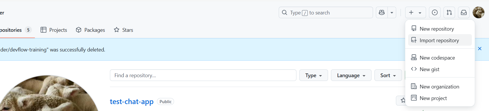
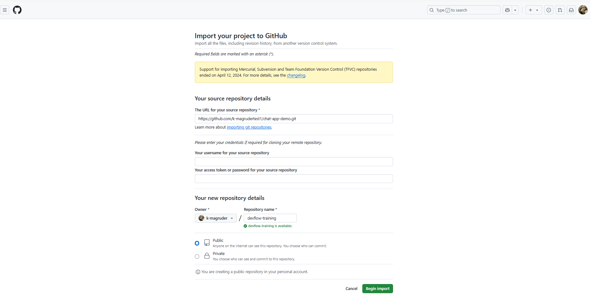
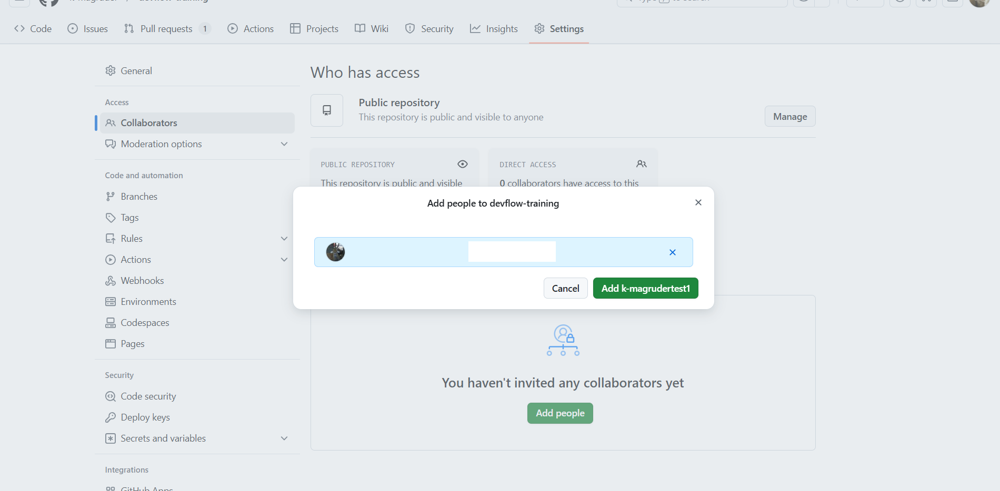
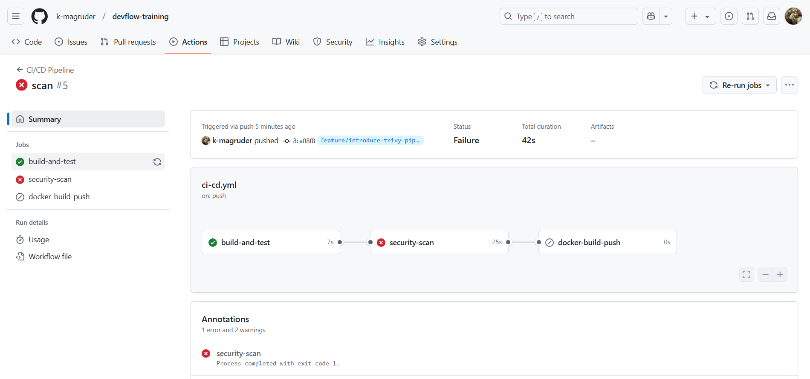

*ハンズオンの手順の参照とハンズオンの実施は、ブラウザで別タブか別ウィンドウを開いて行うことをおすすめします。  
*二人一組を想定(開発者とレビューア)していますが、一人でも実施可能です。

# devflow-handson

## 0.事前準備

[//]: # (TODO: repositoryのimport手順をスクショ付きで載せて欲しいです)

0-1. 以下のレポジトリをimportします。Owner は ご自身のユーザスペース or ユーザアカウントを選択してください。repository name は `devflow-training` とします。  
   また、Repository は `Public` で作成します。  
URL：https://github.com/k-magrudertest1/chat-app-demo.git





0-2. 「devflow-training」という Repository が表示されていればokです。

0-3. Settings > General > Collaborators にて、「Add people」をクリックし、共同作業者を招待します。

0-4. 「Add <共同作業者>」をクリックします。



0-5. Repository に招待された旨の通知が共同作業者に届きます。「Accept invitation」をクリックします。


0-6. 「Accept invitation」をクリックします。


## 1.作業環境の構築と動作確認

1-1. 「devflow-training」という Repository で作業します。

1-2. 画面の左上タブの「<> Code」が選択されていることを確認してください。

1-3. 「main」と表示されている部分をクリックします。

1-4. 「Find or create a branch」に `feature/show-username` と入力します。

1-5. 「Create branch *feature/show-username* from *main*」をクリックします。

1-6. 画面右側、緑色で表示されている「<> Code」をクリックし、「Create codespace on feature/show-user...」をクリックします。


---

1-7. codespace が起動されたら、ターミナルで現在のアプリの状態を確認します。

1-8. codespace 内のターミナルで、以下のコマンドを実行し、現状テストにクリアすることを確認します。(テストファイルが2件、テスト項目6件がクリアしていることがわかります。)
   テストを確認後、「q」を押下することで、再度プロンプトを表示することができます。

```
npm test
```


1-9. codespace 内のターミナルで、以下のコマンドを実行し、コンテナイメージをビルドします。

```
docker build -t test:1 .
```

1-10. 以下のコマンドで、コンテナイメージが作成されたことを確認します。

```
docker image ls
```

1-11. 以下のコマンドで、先ほど作成したコンテナイメージを使用し、コンテナを起動します。

```
docker run -dp 3000:3000 test:1
```

1-12. 画面右下にポップアップが表示されます。「ブラウザーで開く」をクリックします。


1-13. 「メッセージを入力」に文字を入力し、「送信」をクリックすることで、入力したメッセージが表示されるシンプルなチャットアプリです。


1-14. 以下のコマンドで、先ほど起動したコンテナを削除します。

```
docker rm -f $(docker ps -qa)
```

---
## 2.自動テストと機能の追加

2-1. はじめに、「tests/messageHandler.test.js」ファイルを編集します。(以下のファイルをコピー&ペーストし、差分を確認します)

```
import { describe, it, expect } from 'vitest';
import messageHandler from '../src/messageHandler';

describe('validateMessage', () => {
    describe('送信できるメッセージかどうか検証できる', () => {
        it('空のメッセージを渡すとfalseを返す', () => {
            const data = { username: 'test', message: '' };
            expect(messageHandler.validateMessage(data)).toBe(false);
        });
        // ====== ここからが追加項目
        it('空のユーザー名を渡すとfalseを返す', () => {
            const data = { username: '', message: 'hello' };
            expect(messageHandler.validateMessage(data)).toBe(false);
        });
        
        it('ユーザー名のみ渡すとfalseを返す', () => {
            const data = { username: 'test' };
            expect(messageHandler.validateMessage(data)).toBe(false);
        });
        // ====== ここまでが追加項目
        
        it('文字列helloを渡すとtrueを返す', () => {
            const data = { username: 'test', message: 'hello' };
            expect(messageHandler.validateMessage(data)).toBe(true);
        });
    });
});

describe('formatMessage', () => {
    describe('メッセージ文字列の前後空白を削除できる', () => {
        it('helloを渡すとそのままhelloを返す', () => {
            const data = { message: 'hello' };
            const result = messageHandler.formatMessage(data);

            expect(result).toEqual({
                message: 'hello',
                timestamp: expect.any(String)
            });
        });

        it('_hello_を渡すと空白を削除してhelloを返す', () => {
            const data = { message: ' hello ' };
            const result = messageHandler.formatMessage(data);

            expect(result).toEqual({
                message: 'hello',
                timestamp: expect.any(String)
            });
        });
    });
});
```

2-2. codespace 内のターミナルで、以下のコマンドを実行し、テストを行います。(テストファイル1件、うちテスト項目1件が failed となっていることがわかります。)
   テストを確認後、「q」を押下することで、再度プロンプトを表示できます。

```
npm test
```


[//]: # (TODO: Best Effortでやってもらいたいですが一度commitとpushをしてCI上でテストが落ちることを確認する作業を追加してほしいです)

2-3. 「src/messageHandler.js」ファイルを編集します。(以下のファイルをコピー&ペーストし、差分を確認します)

```
class MessageHandler {
  validateMessage(data) {
    if (!data.username || !data.message) {  // usernameがない場合の条件分岐の追加
      return false;
    }
    return data.username.trim().length > 0 && data.message.trim().length > 0;  // usernameのtrim処理の追加
  }

  formatMessage(data) {
    return {
      message: data.message.trim(),
      timestamp: new Date().toISOString()
    };
  }
}

module.exports = new MessageHandler();
```

2-4. codespace 内のターミナルで、以下のコマンドを実行し、テストを行います。(テスト項目がクリアしたことがわかります。)
   テストを確認後、「q」を押下することで、再度プロンプトを表示できます。

```
npm test
```

[//]: # (TODO: Best Effortでやってもらいたいですが一度commitとpushをしてCI上でもテストが通ることを確認する作業を追加してほしいです)

2-5. 再び、「tests/messageHandler.test.js」ファイルを編集します。(以下のファイルをコピー&ペーストし、差分を確認します)

```
import { describe, it, expect } from 'vitest';
import messageHandler from '../src/messageHandler';

describe('validateMessage', () => {
    describe('送信できるメッセージかどうか検証できる', () => {
        it('空のメッセージを渡すとfalseを返す', () => {
            const data = { username: 'test', message: '' };
            expect(messageHandler.validateMessage(data)).toBe(false);
        });

        it('空のユーザー名を渡すとfalseを返す', () => {
            const data = { username: '', message: 'hello' };
            expect(messageHandler.validateMessage(data)).toBe(false);
        });

        it('ユーザー名のみ渡すとfalseを返す', () => {
            const data = { username: 'test' };
            expect(messageHandler.validateMessage(data)).toBe(false);
        });

        it('文字列helloを渡すとtrueを返す', () => {
            const data = { username: 'test', message: 'hello' };
            expect(messageHandler.validateMessage(data)).toBe(true);
        });
    });
});

describe('formatMessage', () => {
    describe('メッセージ文字列の前後空白を削除できる', () => {
        it('testとhelloを渡すとそのままtestとhelloを返す', () => {  // 変更項目
            const data = { username: 'test', message: 'hello' };  // 変更項目
            const result = messageHandler.formatMessage(data);

            expect(result).toEqual({
                username: 'test',  // 追加項目
                message: 'hello',
                timestamp: expect.any(String)
            });
        });

        it('_test_と_hello_を渡すと空白を削除してtestとhelloを返す', () => {  // 変更項目
            const data = { username: ' test ', message: ' hello ' };  // 変更項目
            const result = messageHandler.formatMessage(data);

            expect(result).toEqual({
                username: 'test',    // 追加項目
                message: 'hello',
                timestamp: expect.any(String)
            });
        });
    });
});
```

2-6. codespace 内のターミナルで、以下のコマンドを実行し、テストを行います。(テストファイル1件、うちテスト項目2件が failed となっていることがわかります。)
   テストを確認後、「q」を押下することで、再度プロンプトを表示できます。

```
npm test
```


[//]: # (TODO: Best Effortでやってもらいたいですが一度commitとpushをしてCI上でテストが落ちることを確認する作業を追加してほしいです)

2-7. 「src/messageHandler.js」ファイルを編集します。(以下のファイルをコピー&ペーストし、差分を確認します)

```
class MessageHandler {
  validateMessage(data) {
    if (!data.username || !data.message) {
      return false;
    }
    return data.username.trim().length > 0 && data.message.trim().length > 0;
  }

  formatMessage(data) {
    return {
      username: data.username.trim(),  // 追加された項目
      message: data.message.trim(),
      timestamp: new Date().toISOString()
    };
  }
}

module.exports = new MessageHandler();
```

[//]: # (TODO: Best Effortでやってもらいたいですが一度commitとpushをしてCI上でもテストが通ることを確認する作業を追加してほしいです)

2-8. アクセス時にユーザー名を入力できるように修正するために「public/index.html」ファイルを編集します。(以下のファイルをコピー&ペーストし、差分を確認します)


```
<!DOCTYPE html>
<html>
<head>
  <title>シンプルチャット</title>
  <meta charset="UTF-8">
  <style>
    body { margin: 0; padding: 20px; font-family: sans-serif; }
    #messages { list-style-type: none; margin: 0; padding: 0; }
    #messages li { padding: 5px 10px; }
    #messages li:nth-child(odd) { background: #eee; }
    #form { background: #fff; padding: 3px; position: fixed; bottom: 0; width: 100%; }
    #input { border: 1px solid #ddd; padding: 10px; width: 80%; margin-right: .5%; }
    #form button { width: 18%; background: #4CAF50; color: white; padding: 10px; border: none; }
    .username { font-weight: bold; color: #2196F3; margin-right: 8px; }
  </style>
</head>
<body>
  <ul id="messages"></ul>
  <form id="form" action="">
    <input id="input" autocomplete="off" placeholder="メッセージを入力..."/><button>送信</button>
  </form>

  <script src="/socket.io/socket.io.js"></script>
  <script>
    let username = '';
    while (!username.trim()) {
      username = prompt('ユーザー名を入力してください:');
    }

    const socket = io({
      transports: ['websocket', 'polling'],
      reconnectionAttempts: 5,
      reconnectionDelay: 1000
    });
    const form = document.getElementById('form');
    const input = document.getElementById('input');
    const messages = document.getElementById('messages');

    form.addEventListener('submit', (e) => {
      e.preventDefault();
      if (input.value) {
        socket.emit('chat message', {
          username: username,
          message: input.value
        });
        input.value = '';
      }
    });

    socket.on('chat message', (data) => {
      const li = document.createElement('li');
      const usernameSpan = document.createElement('span');
      usernameSpan.className = 'username';
      usernameSpan.textContent = data.username;
      
      li.appendChild(usernameSpan);
      li.appendChild(document.createTextNode(data.message));
      messages.appendChild(li);
      window.scrollTo(0, document.body.scrollHeight);
    });
  </script>
</body>
</html>
```

2-9. codespace 内のターミナルで、以下のコマンドを実行し、テストを行います。(テスト項目がクリアしたことがわかります。)
   テストを確認後、「q」を押下することで、再度プロンプトを表示できます。

```
npm test
```

---

2-10. codespace 内のターミナルで、以下のコマンドを実行し、変更したコードで改めてコンテナイメージをビルドします。

```
docker build -t test:2 .
```

2-11. 以下のコマンドで、コンテナイメージが作成されたことを確認します。

```
docker image ls
```

2-12. 以下のコマンドで、先ほど作成したコンテナイメージを使用し、コンテナを起動します。

```
docker run -dp 3000:3000 test:2
```

2-13. 画面右下にポップアップが表示されます。「ブラウザーで開く」をクリックします。

2-14. ポップアップで、「ユーザー名を入力してください」と表示されます。任意のユーザー名を入力してください。


2-15. 次に、「メッセージを入力」に文字を入力し、「送信」をクリックすることで、先ほど入力したユーザー名と、入力したメッセージが表示されます。


2-16. 以下のコマンドで、先ほど起動したコンテナを削除します。

```
docker rm -f $(docker ps -qa)
```

2-17. ここで、変更作業を commit して、push します。コミットメッセージを入力して、「コミット」をクリックします。


2-18. 「変更の同期」をクリックします。


---

2-19. codespace から抜けて、「devflow-training」という Repository に戻ります。

2-20. 「feature/show-username」ブランチ上で作業します。

2-21. 「Actions」タブをクリックします。

2-22. 先ほど コミット したことで実行されたパイプラインのステータスを確認します。(パイプラインが失敗していないことを確認します。)


## 3.変更差分をmainブランチにマージする

3-1. 「feature/show-username」ブランチ上で、pull request を作成します。

3-2. 作成した pull request の Reviewers に共同作業者を追加します。(追加された共同作業者がレビューを行います)


---

**<↓レビューア作業ここから↓>**

3-3. レビューアは、作成された pull request を開きます。

3-4. 「Add your review」をクリックします。


3-5. 変更内容を確認したら、「Review changes」をクリックし、「問題なさそうですb」とコメントを記し、「Approve」を選択して、「Submit review」をクリックします。


**<↑レビューア作業ここまで↑>**

---

3-6. 開発者は、レビューアから Approved されたことを確認します。

3-7. 「Merge pull request」をクリックします。

3-8. 「Confirm merge」をクリックします。

3-9. 「Delete branch」をクリックします。

3-10. 「Delete codespace」をクリックします。

3-11. 「Actions」タブをクリックします。

3-12. 先ほど pull request をマージしたことで実行されたパイプラインのステータスを確認します。(パイプラインが失敗していないことを確認します。)


---

## 4.セキュリティスキャンの追加とCVEの対応

4-1. 「devflow-training」という Repository で作業します。

4-2. 画面の左上タブの「<> Code」が選択されていることを確認してください。

4-3. 「main」と表示されている部分をクリックします。

4-4. 「Find or create a branch」に `feature/introduce-trivy-pipeline` と入力します。

4-5. 「Create branch *feature/introduce-trivy-pipeline* from *main*」をクリックします。

4-6. 画面右側、緑色で表示されている「<> Code」をクリックし、「Create codespace on feature/introduce-t...」をクリックします。

---

4-7. 「.github/workflows/ci-cd.yml」ファイルを編集します。(以下のファイルをコピー&ペーストし、差分を確認します)

```
name: CI/CD Pipeline

on:
  push:
    branches: [ 'feature/**' ]
  pull_request:
    types: [ closed ]
    branches: [ 'main' ]

env:
  REGISTRY: ghcr.io
  IMAGE_NAME: ${{ github.repository }}
  IMAGE_TAG: run-${{ github.run_number }}

jobs:
  build-and-test:
    runs-on: ubuntu-latest
    
    steps:
      - uses: actions/checkout@v3
      
      - name: Setup Node.js
        uses: actions/setup-node@v3
        with:
          node-version: '18'
          cache: 'npm'
          
      - name: Install dependencies
        run: npm ci
        
      - name: Run tests
        run: npm test

  security-scan:
    needs: build-and-test
    runs-on: ubuntu-latest
    
    steps:
      - uses: actions/checkout@v3
      
      - name: Build Docker image for scanning
        uses: docker/build-push-action@v4
        with:
          context: .
          load: true
          tags: ${{ env.REGISTRY }}/${{ env.IMAGE_NAME }}:${{ env.IMAGE_TAG }}
      
      - name: Run Trivy vulnerability scanner
        uses: aquasecurity/trivy-action@master
        with:
          image-ref: ${{ env.REGISTRY }}/${{ env.IMAGE_NAME }}:${{ env.IMAGE_TAG }}
          format: 'table'
          exit-code: '1'
          ignore-unfixed: true
          vuln-type: 'os,library'
          severity: 'CRITICAL,HIGH'

  docker-build-push:
    if: github.event.pull_request.merged == true
    needs: security-scan
    runs-on: ubuntu-latest
    permissions:
      contents: read
      packages: write
    outputs:
      image-digest: ${{ steps.build.outputs.digest }}
    
    steps:
      - uses: actions/checkout@v3
      
      - name: Log in to GitHub Container Registry
        uses: docker/login-action@v2
        with:
          registry: ${{ env.REGISTRY }}
          username: ${{ github.actor }}
          password: ${{ secrets.GITHUB_TOKEN }}

      - name: Extract metadata for Docker
        id: meta
        uses: docker/metadata-action@v4
        with:
          images: ${{ env.REGISTRY }}/${{ env.IMAGE_NAME }}
          tags: |
            type=raw,value=${{ env.IMAGE_TAG }}
                  
      - name: Build and push Docker image
        id: build
        uses: docker/build-push-action@v4
        with:
          context: .
          push: true
          tags: ${{ steps.meta.outputs.tags }}
          labels: ${{ steps.meta.outputs.labels }}
```

4-8. ここで、変更作業を commit して、push します。コミットメッセージを入力して、「コミット」をクリックします。

4-9. 「変更の同期」をクリックします。

---

4-10. codespace から抜けて、「devflow-training」という Repository に戻ります。

4-11. 「feature/introduce-trivy-pipeline」ブランチ上で作業します。

4-12. 「Actions」タブをクリックします。

4-13. 先ほど コミット したことで実行されたパイプラインのステータスを確認します。(追加したセキュリティスキャンが失敗していることを確認します。)



---

4-14. codespaceに戻ります。

4-15. まず、「.github/workflows/ci-cd.yml」ファイルを編集します。( `node-version: '18'` を `node-version: '23'` に変更してください。)

4-16. 次に、「Dockerfile」ファイルを編集します。( `FROM node:18-slim` を `FROM node:23-slim` に変更してください。)

4-17. 変更作業を commit して、push します。コミットメッセージを入力して、「コミット」をクリックします。

4-18. 「変更の同期」をクリックします。

---

4-19. codespace から抜けて、「devflow-training」という Repository に戻ります。

4-20. 「feature/introduce-trivy-pipeline」ブランチ上で作業します。

4-21. 「Actions」タブをクリックします。

4-22. 先ほど コミット したことで実行されたパイプラインのステータスを確認します。(パイプラインが失敗していないことを確認します。)

## 5.変更差分をmainブランチにマージする

5-1. 「feature/introduce-trivy-pipeline」ブランチ上で、pull request を作成します。

5-2. 作成した pull request の Reviewers に共同作業者を追加します。(追加された共同作業者がレビューを行います)

---

**<↓レビューア作業ここから↓>**

5-3. レビューアは、作成された pull request を開きます。

5-4. 「Add your review」をクリックします。

5-5. 変更内容を確認したら、「Review changes」をクリックし、「問題なさそうですb」とコメントを記し、「Approve」を選択して、「Submit review」をクリックします。

**<↑レビューア作業ここまで↑>**

---

5-5. 開発者は、レビューアから Approved されたことを確認します。

5-6. 「Merge pull request」をクリックします。

5-7. 「Confirm merge」をクリックします。

5-8. 「Delete branch」をクリックします。

5-9. 「Delete codespace」をクリックします。

5-10. 「Actions」タブをクリックします。

5-11. 先ほど pull request をマージしたことで実行されたパイプラインのステータスを確認します。(パイプラインが失敗していないことを確認します。)


以上でハンズオンが終了となります。お疲れ様でした。
